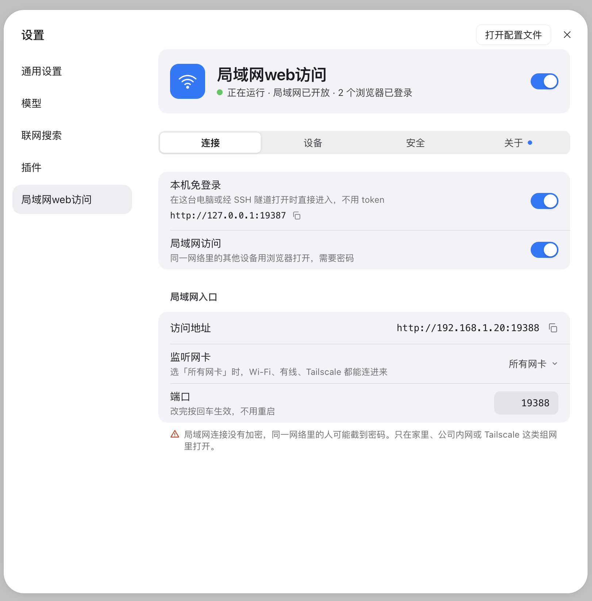
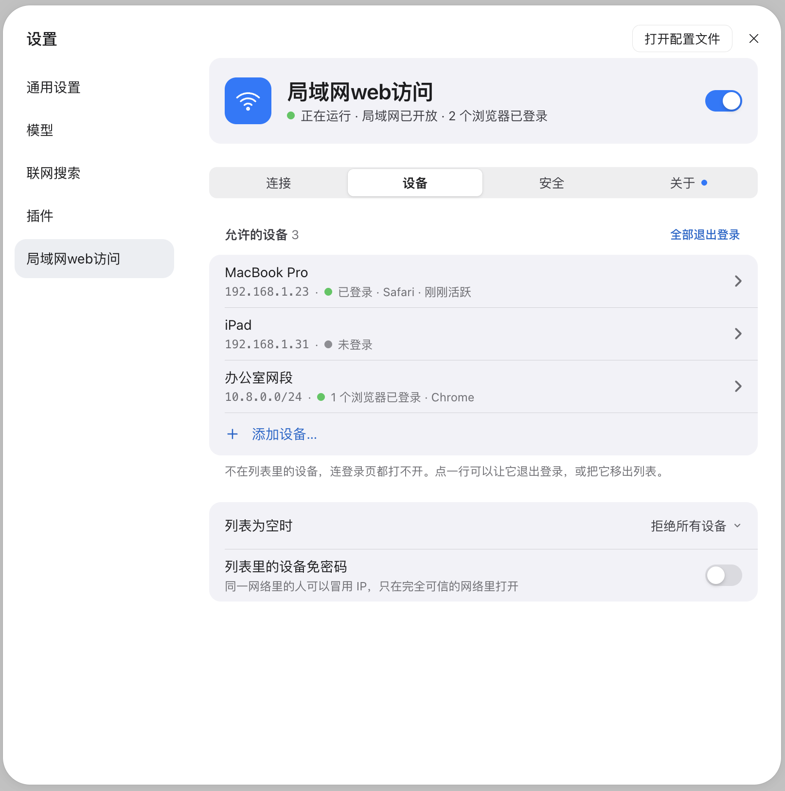
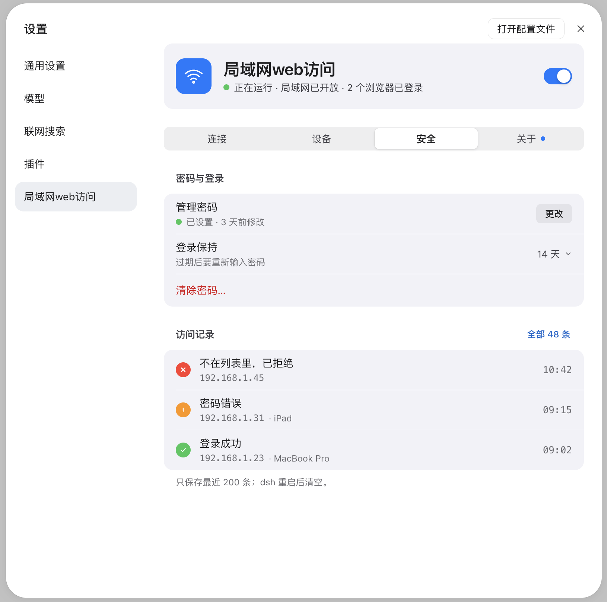
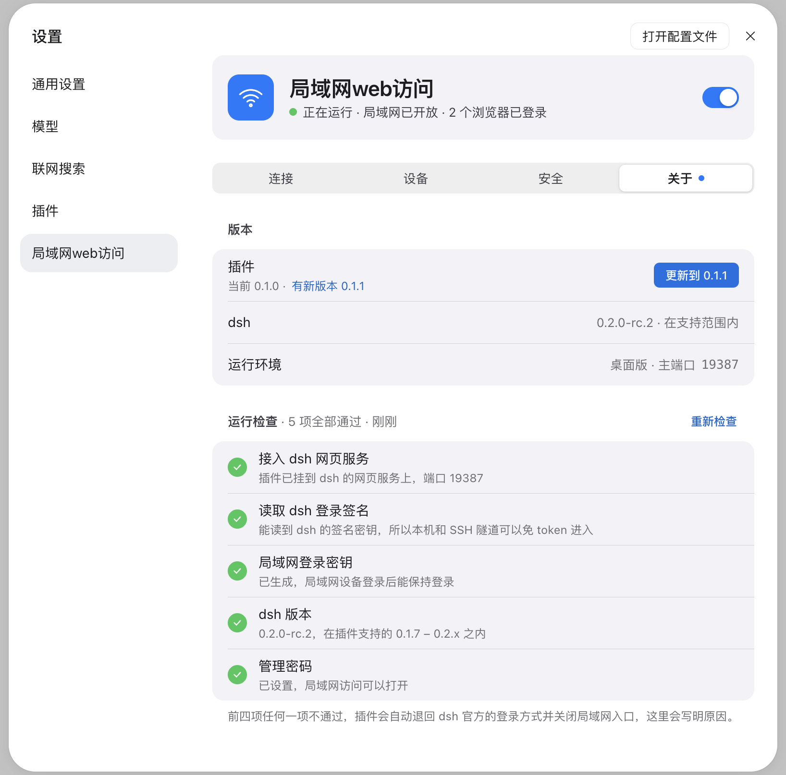
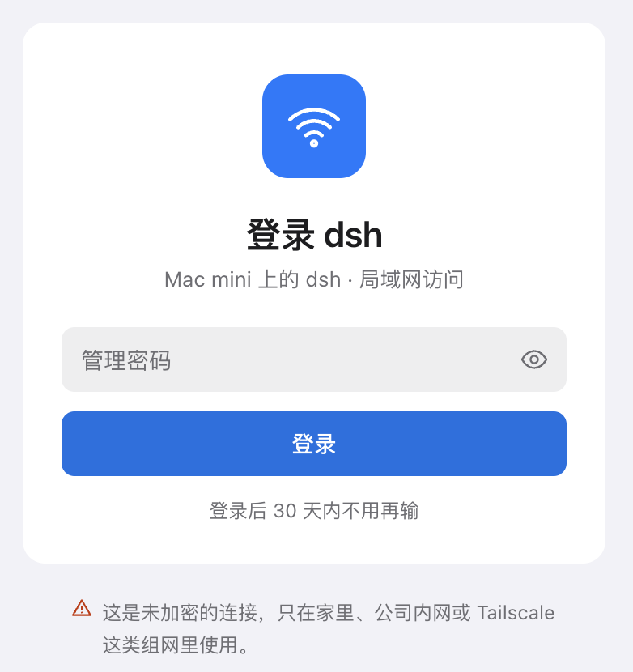
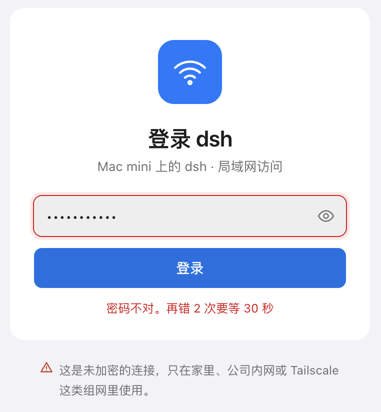
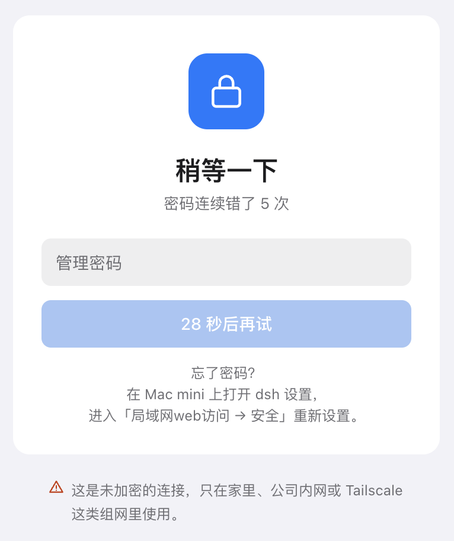
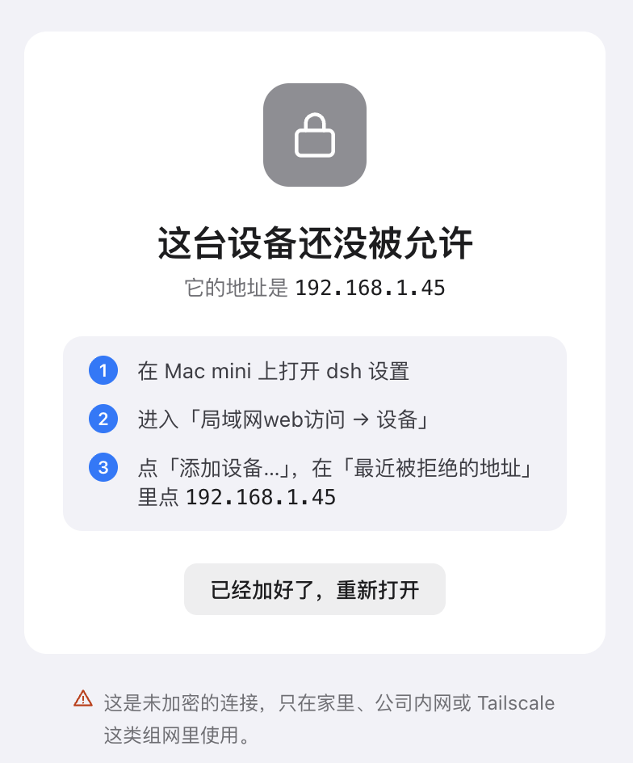
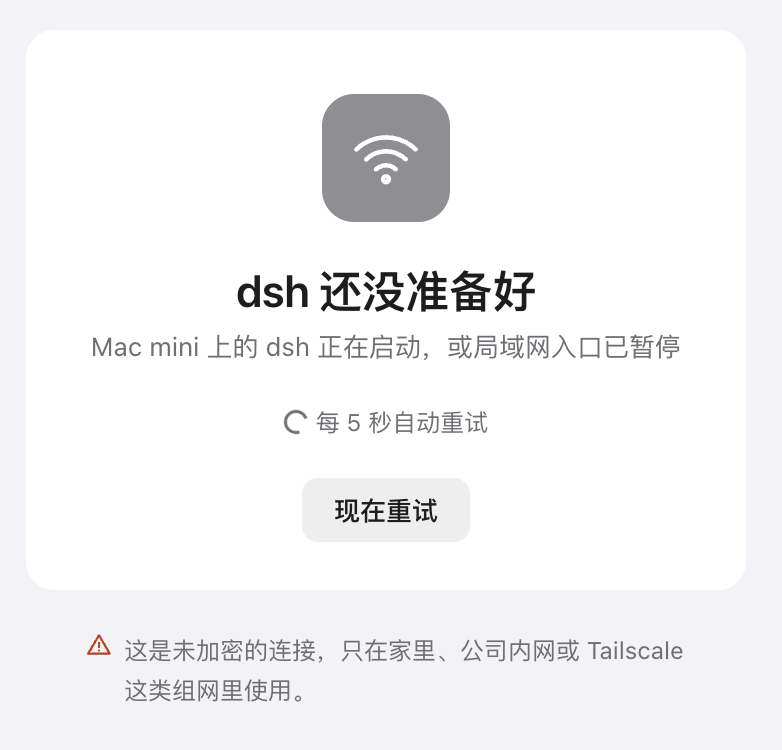

# dsh-lan-web-access

> DeepSeek Harness（dsh）的局域网 Web 访问插件 —— 在**局域网或异地组网**（如 Tailscale）环境里，让多台设备用浏览器**同时访问同一台 dsh 主机**：笔记本、平板、手机随手打开就能用，多人多设备同时协作。适合家庭、小团队、超级用户、一人公司（OPC）等多设备场景。由**允许列表 + 管理密码**把关；主机本机和 SSH 隧道免 token 直接进入。

[](./LICENSE)

## 它解决什么问题

- dsh 打开页面需要启动时打印的 token 链接；token 每次启动都变、桌面版还不对外显示，日常使用不可接受。
- dsh 只监听本机地址，家里 / 团队其他人没法直接用浏览器访问。
- 本插件在 dsh 官方认证闸门**前面**补一层「替你拿 cookie」的判断，并另开一个**局域网入口**（允许列表 + 管理密码），让家人、同事安全地用上这台电脑上的 dsh。

插件**不替换、不拆除** dsh 的任何部件；不兼容时自动退回 dsh 官方认证，**宁可进不去，不放错人**。

## 功能

- **本机免 token**：装 dsh 的电脑上，浏览器直接打开即用，重启后依然有效。
- **SSH 隧道免密**：经 SSH 隧道访问视同本机，免 token、免密码，全部设置可用。
- **局域网访问**（可选，默认关闭）：允许列表 + 管理密码，独立监听端口（默认主端口 + 1），不占 dsh 自己的端口。
- **设备管理**：允许的设备一张表 —— 名字、IP / 网段、登录状态；可退出登录、移出列表、全部退出；添加时列出「最近被拒绝的地址」一键填入；列表内设备可免密码。
- **登录页五种状态**：正常、密码错误（提示还能错几次）、锁定倒计时、不在列表、dsh 未就绪。
- **访问记录**：拒绝、登录、退出、更新等事件，最多 200 条，可按类型筛选。
- **运行检查 + 安全退出**：启动时跑五项检查，dsh 升级后不兼容时自动停用并交还官方认证。
- **一键更新**：设置页显示当前 / 最新版本，一键升级插件。
- **双端双系统**：桌面版（Desktop）与网页版（WebUI）同一个包；macOS 与 Windows 通用。

## 界面

设置页（设置 → 局域网web访问）为苹果风格，分四段：**连接 / 设备 / 安全 / 关于**；局域网登录页为独立网页，五种状态。

**设置页**

<table>
  <tr>
    <td align="center"><br>连接</td>
    <td align="center"><br>设备</td>
  </tr>
  <tr>
    <td align="center"><br>安全</td>
    <td align="center"><br>关于</td>
  </tr>
</table>

**局域网登录页**

<table>
  <tr>
    <td align="center"><br>正常</td>
    <td align="center"><br>密码错误</td>
    <td align="center"><br>错太多次</td>
    <td align="center"><br>设备不在列表</td>
    <td align="center"><br>dsh 还没准备好</td>
  </tr>
</table>

> 截图里的 IP、设备名、电脑名均为示例数据。

## 安装

前提：电脑上已安装 dsh （桌面版或Web版）。

**从 GitHub 直接安装**（免构建，仓库里已带编译好的 `lib/`）：

```sh
# 桌面版
dsh plugin --profile desktop add github:<你的GitHub用户名>/dsh-lan-web-access

# 网页版（dsh web）
dsh plugin --profile web add github:<你的GitHub用户名>/dsh-lan-web-access

# 指定某个版本（标签）
dsh plugin --profile web add github:<你的GitHub用户名>/dsh-lan-web-access#v0.1.0
```

**从 npm 安装**（发布到 npm 之后可用）：

```sh
dsh plugin --profile desktop add dsh-lan-web-access@latest
dsh plugin --profile web add dsh-lan-web-access@latest
```

**从本地目录安装**（开发时用）：

```sh
dsh plugin --profile desktop add /path/to/dsh-lan-web-access
```

安装后重启桌面版（或 `dsh web`）。

## 快速上手

### 本机

浏览器直接打开：

- 桌面版：`http://127.0.0.1:19387`
- 网页版：`http://127.0.0.1:3080`（端口以 dsh 实际为准，设置页里会显示）

无需 token，直接进入。

### 局域网

1. 打开 dsh → 设置 → 局域网web访问 →「安全」，先设一个**管理密码**（至少 12 位）。
2. 到「连接」打开「局域网访问」，记下**访问地址**（形如 `http://<这台电脑的IP>:<端口>`）。
3. 到「设备」把家人 / 同事的设备加进**允许列表**。
4. 他们在自己的浏览器打开访问地址，输密码进入。不在列表里的设备会看到「这台设备还没被允许」页，页面上写着它自己的 IP 和添加方法。

> 第一次打开局域网时，系统防火墙（Windows 防火墙，或开着防火墙的 macOS）可能弹窗问是否允许 dsh 接受连接，点「允许」即可；设置页会在第一台设备连上之前提示这一步。

### SSH 隧道（可选，等同本机）

```sh
ssh -L 19387:127.0.0.1:19387 主机地址
# 然后本机浏览器打开 http://127.0.0.1:19387
```

## 设置页说明

顶部**状态头**：一个总开关（关掉即回到 dsh 官方 token 方式，所有设置保留）+ 当前状态。

| 分段 | 内容 |
| --- | --- |
| 连接 | 本机免登录（含本机访问地址，可复制）；局域网访问开关；局域网入口：访问地址、监听网卡（从本机网卡里选）、端口（回车即生效，无需重启） |
| 设备 | 允许的设备一张表（名字、IP / 网段、登录状态、哪个浏览器、多久前活跃）；点开可改名、退出登录、移出列表（可撤销）；「最近被拒绝的地址」一键添加；列表为空时的策略；列表内设备免密码 |
| 安全 | 管理密码（原地设置 / 更改，清除时弹确认）；登录保持 1 / 7 / 14 / 30 天；访问记录（最近 3 条 + 全部面板按类型筛选） |
| 关于 | 插件版本与一键更新；dsh 版本是否在支持范围；运行环境（桌面版 / 网页版 · 端口）；五项运行检查与「重新检查」 |

**本机与局域网设备**：改设置、密码、允许列表、更新、踢下线只限**本机**；局域网设备打开设置只能看到「连接 / 关于」两段，只读。

## 安全

- **明文 HTTP**：局域网模式凭据可被同网段抓包。建议仅可信内网或异地组网（如 Tailscale）内使用；本机 / SSH 隧道不受影响。设置页和登录页常驻「连接未加密」提示。
- 密码 **scrypt 散列**；配置 `remote-access.json` 权限 0600；密码与密钥不入日志、不进会话上下文。
- 登录可随时吊销：改密码 / 踢下线 / 移出列表 / 关闭局域网**即时生效**，已连着的长连接一起断开。
- 登录限速：每 IP 连续 5 次失败锁 30 秒 + 全局指数退避，本机豁免。
- **没有密码不能开启局域网**；首次设置密码只允许在本机。
- 卸载插件后配置文件保留，重装后设置还在；删掉 `~/.dsh/remote-access.json` 即可彻底清除。

## 兼容性

| 系统 | 桌面版 | 网页版（WebUI） |
| --- | --- | --- |
| macOS（Apple 芯片） | ✅ | ✅ |
| Windows（64 位） | ✅ | ✅ |

支持的 dsh 版本范围：`>=0.1.7-rc.1 <0.3.0-0`。

## FAQ

**Q：装了以后，桌面版 App 自己会受影响吗？**
不会。插件不碰桌面版自己的连接，App 照常用。

**Q：关掉总开关会发生什么？**
立即回到 dsh 官方 token 方式，局域网入口关闭、已连着的局域网设备断开；设置全部保留，再开原样恢复。

**Q：忘记管理密码怎么办？**
在装 dsh 的电脑本机打开设置 → 局域网web访问 → 安全，直接改（改密码不需要旧密码）。

**Q：局域网设备能改设置吗？**
不能。敏感操作只限本机，局域网设备是只读视图。

## 开发与贡献

构建、测试、源码结构、设计规范见 [CONTRIBUTING.md](./CONTRIBUTING.md)。

## 许可证

[MIT](./LICENSE) © 2026 Colin
